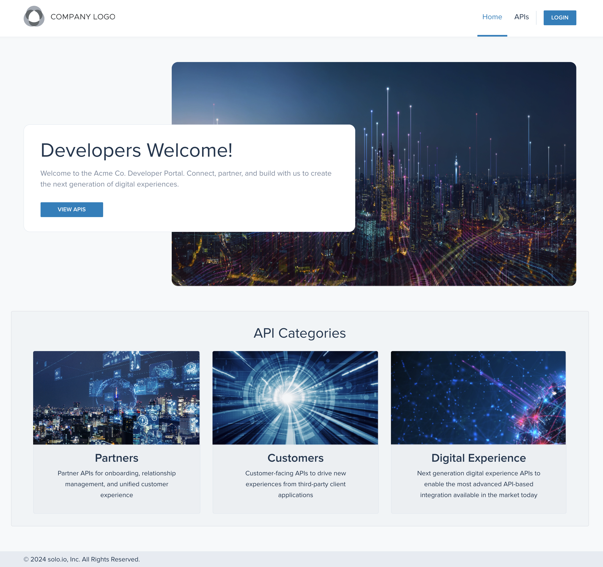
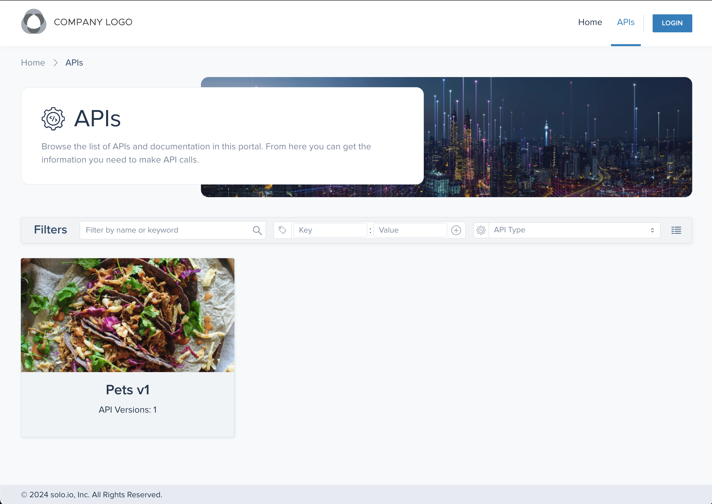
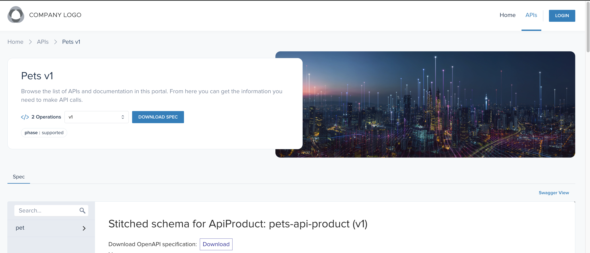

# Gloo Platform Portal UI

## Description

This is an example Solo.io Gloo Platform Dev Portal frontend app, built with [Vite](https://vitejs.dev/), and configured to use React and Typescript. It can be used to view information about your APIs and usage plans, add or delete API keys, and view your OpenAPI schemas using an embedded [Redoc UI](https://github.com/Redocly/redoc) or [Swagger UI](https://swagger.io/tools/swagger-ui/) view. It also can be personalized with images and colors to match your branding and preferences.

## Setup

**For the full setup instructions, including the required Gloo Gateway Kubernetes resources, please check the [solo.io docs site](https://docs.solo.io/gloo-gateway/main/portal/dev-portal/frontend/portal-frontend/). The following steps assume that these resources are already applied.**

## Building the Project

1. Run the following to download and initialize the latest commit of this repository's main branch.

   - This command uses [tmplr](https://github.com/loreanvictor/tmplr) for personalization of your developer portal. Currently, this just includes adding your company name, which shows up on the home page and on the website title, but could include other customization options in the future. The tmplr setup can be re-run at any time by running `npx tmplr` from the project's root directory.

   ```shell
   mkdir portal-test && cd portal-test && npx tmplr solo-io/dev-portal-starter#main
   ```

2. Build your image.

   ```sh
   docker build -t "your-image-name"
   ```

3. Push your image:

   ```shell
   docker push "your-image-name"
   ```

4. Go through the steps on the [solo.io docs site](https://docs.solo.io/gloo-gateway/main/portal/dev-portal/frontend/portal-frontend/) to set up dev portal resources and deploy your image. Use the same image name that you used to build the image for the portal-frontend deployment's `spec.template.containers.image` field.

- If you would like to run your image outside the mesh you will need to:

  - Update your auth provider to enable the PKCE auth flow.
  - Update your portal server's `CorsPolicy` to include your portal frontend's domain.
  - Update your portal server's `ExtAuthPolicy` to include the inlineJWKs from your auth provider.
  - Run your portal frontend app with this command, replacing the variables to match your configuration:

    ```sh
    docker run \
    --name portal-frontend \
    -p 4000:4000 \
    -e VITE_PORTAL_SERVER_URL="/v1" \
    -e VITE_CLIENT_ID="your-client-id" \
    -e VITE_TOKEN_ENDPOINT="your-token-endpoint" \
    -e VITE_AUTH_ENDPOINT="your-auth-endpoint" \
    -e VITE_LOGOUT_ENDPOINT="your-logout-endpoint" \
    "your-image-name"
    ```

  - If running this app in the mesh with an `ExtAuthPolicy` that has an "oidcAuthorizationCode" config, you will need to update the image name and environment variables in your portal frontend deployment. See the [Environment Variables if using an oidcAuthorizationCode ExtAuthPolicy](#environment-variables-if-using-an-oidcauthorizationcode-extauthpolicy) of this Readme for more details.

## UI Development

**Prerequisites for Local Development**:

1. Install [Node v16.14.2](https://nodejs.org/en/blog/release/v16.14.2) and [yarn](https://yarnpkg.com/)

2. Create a `.env.local` file in the `projects/ui` folder. Replace environment variable values to match your Gloo Platform Portal and oauth provider's installation. This file is ignored by git.

   ```sh
   VITE_PORTAL_SERVER_URL="/v1"
   VITE_CLIENT_ID="your-client-id"
   VITE_TOKEN_ENDPOINT="your-token-endpoint"
   VITE_AUTH_ENDPOINT="your-auth-endpoint"
   VITE_LOGOUT_ENDPOINT="your-logout-endpoint"
   ```

   <details><summary>Sample values for Keycloak</summary>

   ```sh
   VITE_PORTAL_SERVER_URL="/v1"
   VITE_CLIENT_ID="your-client-id"   # the client registered in the Auth Server
   VITE_TOKEN_ENDPOINT="https://${KEYCLOAK_URL}/realms/master/protocol/openid-connect/token"
   VITE_AUTH_ENDPOINT="https://${KEYCLOAK_URL}/realms/master/protocol/openid-connect/auth"
   VITE_LOGOUT_ENDPOINT="https://${KEYCLOAK_URL}/realms/master/protocol/openid-connect/logout"
   ```

   </details>

3. Run the UI locally:

```shell
make run-ui
```

## UI Iteration with Storybook and Mock Data

UI iteration can also be done with [Storybook](https://storybook.js.org/). Storybook can run without any kubernetes resources set up. API responses are mocked using [react-magnetic-di](https://www.npmjs.com/package/react-magnetic-di) and [@faker-js/faker](https://fakerjs.dev/). The Storybook server can be run on [http:localhost:6006](http:localhost:6006) using the command:

```shell
make run-storybook
```

## Personalization

### Re-Running Initial Setup

The initial setup with [tmplr](https://github.com/loreanvictor/tmplr) can be re-run at any time by running `npx tmplr` from the project's root directory.

### Switching the API Documentation Display

The API details page includes a button to toggle between the Redoc and Swagger views, showing the Redoc view by default. Swagger can be changed to be the default view by modifying `ApiSchemaDisplay.tsx`.

### Colors

Components from the [Mantine library](https://v6.mantine.dev/) are used across the app. Both Mantine and custom components use the colors defined in `./projects/ui/src/Styles/colors.ts`. See `./projects/ui/src/Styles/global-styles/mantine-theme.ts` for how this maps to the Mantine library components.

### Logo

The simplest way to replace the logo used in the top-left of the page is to replace the `logo.svg` file found at the top of the `/Assets` folder.

### Images & Icons

Other images are intended as samples, but are reusable. They can be found at the top level of the `/Assets` folder as well, except for the favicon which is found in `/public`.

All icons can be found, as the others, in the `/Assets` folder, inside `/Icons`. The icons are all SVGs where the colors can be overriden by styling them or by modifying the SVG file. If an icon is added and you want to insert it with our standard approach of `<Icon.some-icon-name />` you will need to also add a reference to it in the `Icons.tsx` file found in the same folder.

## Environment Variables

You can add these environment variables to a `.env.local` file in the `projects/ui` folder. All Vite environment variables need to start with `VITE_` in order for the app to be able to read them.

- `VITE_PORTAL_SERVER_URL` - This is the URL for the Gloo Platform Portal REST server. The default value is "/v1".
  - Note: If using the example `RouteTable` for the "oidcAuthorizationCode" `ExtAuthPolicy` configuration, this should be set to "/portal-server/v1"
- `VITE_SWAGGER_CONFIG_URL` - This is an optional URL for your Swagger configuration file. The URL can be an absolute or relative path, and can be a JSON or YAML file. If you would like to configure the Swagger UI using the [Swagger UI configuration options](https://swagger.io/docs/open-source-tools/swagger-ui/usage/configuration/), you can do this by:
  1. setting this variable, in your `.env.local` file, to `"/swagger-config.yaml"`,
  2. editing the `/projects/ui/public/swagger-config.yaml` file,
  3. verifying your changes (with the `make run-ui` command),
  4. rebuilding the project.
- `VITE_AUDIENCE` - This is an optional parameter if using Auth0 and need to send an audience parameter in your authorization requests. This should not be URL encoded, since it will be URL encoded when the request is sent.
- `VITE_HOME_IMAGE_URL` - This is an optional parameter to set the image URL on the home page.
- `VITE_APIS_IMAGE_URL` - This is an optional parameter to set the image URL on the apis page.
- `VITE_LOGO_IMAGE_URL` - This is an optional parameter to set the image URL for the logo in the upper left.

#### Environment Variables for PKCE Authorization Flow

These variables are required if your authorization server is configured to use the PKCE auth flow. If this app is hosted outside the mesh, then the PKCE auth flow must be used.

- `VITE_CLIENT_ID` - The oauth client id. In Keycloak, this is shown in the client settings of your keycloak instances UI: `<your-keycloak-url>/auth`.
- `VITE_TOKEN_ENDPOINT` - This is the endpoint to get the oauth token. In Keycloak, this is the `token_endpoint` property from: `<your-keycloak-url>/realms/<your-realm>/.well-known/openid-configuration`..
- `VITE_AUTH_ENDPOINT` - This is the endpoint to get the PKCE authorization code. In Keycloak, this is the `authorization_code` property from: `<your-keycloak-url>/realms/<your-realm>/.well-known/openid-configuration`.
- `VITE_LOGOUT_ENDPOINT` - This is the endpoint to end your session. In Keycloak, this is the `end_session_endpoint` property from: `<your-keycloak-url>/realms/<your-realm>/.well-known/openid-configuration`.

#### Environment Variables if using an "oidcAuthorizationCode" `ExtAuthPolicy`

These variables are required if this app is hosted in your mesh, behind a Gloo Platform `RouteTable` that uses an `ExtAuthPolicy` with an "oidcAuthorizationCode" config. In this configuration, your authorization server must be configured to use client id + secret authentication. The `ExtAuthPolicy` in this configuration will handle user sessions with a browser cookie.

- `VITE_APPLIED_OIDC_AUTH_CODE_CONFIG` - This must be set to "true" if using the "oidcAuthorizationCode" config.
- `VITE_OIDC_AUTH_CODE_CONFIG_CALLBACK_PATH` - This is the "callbackPath" value of your "oidcAuthorizationCode" config.
- `VITE_OIDC_AUTH_CODE_CONFIG_LOGOUT_PATH` - This is the "logoutPath" value of your "oidcAuthorizationCode" config.

## Troubleshooting Keycloak

In your Keycloak administration console, make sure that "Direct Access Grants" is enabled in your client settings, and "Web Origins" is set to `*`

## Creating Releases

When making a new release, use the GitHub UI, and name your release in the format: v1.2.3. When the release is published, a new branch will be made (v1.2.x), and a build of that version will be tagged and published to gcr.io/solo-public/docs/portal-frontend:v1.2.3 (replacing v1.2.3 with your tag name).

## Screenshots






